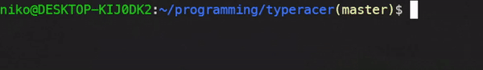

## Introduction
Terminal typing game written in C

## How to run

### on Linux
Requirements:
- GCC (GNU Compiler Collection)
- Make
- ncurses `sudo apt-get install libncurses5-dev libncursesw5-dev`

Compile with:

`make`

If you want to perform a clean build, you can run: `make clean`

run your program with:

`bin/type`

## How is WPM calculated?

$$
WPM = \frac{{words \ typed \ correctly}}{{time \ taken \ in \ minutes}}
$$

> [!NOTE]
> For now, any sequence of characters separated by space is counted as a word.
